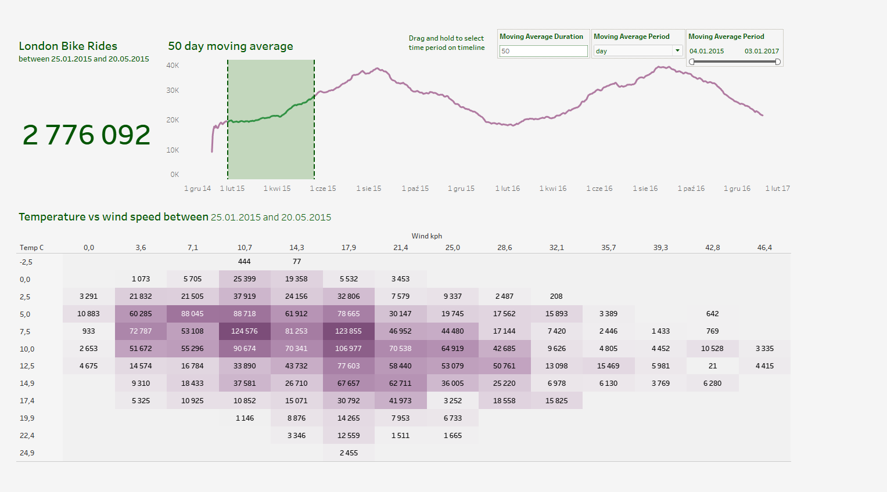

# London Bike Rides - Analysis and Visualization  

## 📌 Project Overview  
This project focuses on analyzing and visualizing bike ride data in London. The dataset, obtained from Kaggle, contains information about bike usage, including timestamps, weather conditions, and traffic data. The goal is to extract meaningful insights by performing data preprocessing, exploratory data analysis (EDA), and advanced visualizations using Python and Tableau.  

## 📂 Files in the Repository  
### 🔹 Datasets:  
- **`london_merged.csv`** – The raw dataset from Kaggle, containing bike ride records along with weather conditions and seasonal details.  
- **`london_bikes_final.xlsx`** – A processed version of the dataset, structured for better analysis.  

### 🔹 Code & Analysis:  
- **`london_bikes.ipynb`** – A Jupyter Notebook that performs:  
  - Data cleaning and preprocessing  
  - Exploratory data analysis (EDA)  
  - Visualization of trends in bike rides  
  - Implementation of moving averages for trend analysis  

### 🔹 Visualizations & Dashboard:  
- **`London Bike Rides - Moving Average and Heatmap.twbx`** – A Tableau Workbook containing interactive visualizations, including:  
  - 📈 **Moving Average Analysis:** A time-series visualization that smooths out short-term fluctuations in bike rides, making long-term trends more visible.  
  - 🌡️ **Heatmap of Bike Usage:** A color-coded heatmap that displays the intensity of bike rides over time, helping to identify peak usage hours and seasonal trends.  
  - 🌦️ **Weather Impact on Bike Usage:** A correlation analysis between weather conditions (temperature, humidity, wind speed) and bike ride frequency.  
  - 📊 **Seasonal Trends Dashboard:** An interactive breakdown of bike usage across different months and seasons, providing insights into user behavior throughout the year.

### 🖼️ Screenshot of the Tableau Dashboard  
Below is a preview of the Tableau visualization:  

  

## 🔍 Key Insights and Features  
- **Data Cleaning & Transformation:** Handled missing values and formatted the dataset for analysis.  
- **Time-Series Analysis:** Used a moving average technique to analyze long-term trends in bike usage.  
- **Interactive Data Exploration:** Tableau dashboards allow users to dynamically explore different aspects of bike rides, such as peak hours, weather conditions, and seasonal variations.  
- **Correlation Analysis:** Investigated the relationship between weather variables and the number of bike rides.  
- **Visual Storytelling:** Designed engaging visualizations to make data-driven insights more accessible.  

## 🛠️ Technologies Used  
- **Python:**  
  - `pandas` – Data cleaning and preprocessing  
- **Tableau:**  
  - Built interactive dashboards for exploring trends and patterns dynamically  
- **Excel:**  
  - Final structuring of the processed dataset for improved usability  

## 📝 How to Use This Project  
1. **Explore the Jupyter Notebook** (`london_bikes.ipynb`) to see how the data was processed and analyzed step by step.  
2. **Open the Tableau Workbook** (`London Bike Rides - Moving Average and Heatmap.twbx`) to interact with the dashboards and explore insights dynamically.  
3. **Refer to the cleaned dataset** (`london_bikes_final.xlsx`) if you want to use structured data for further analysis.  

## 📌 Dataset Source  
The original dataset (`london_merged.csv`) was sourced from Kaggle:  
🔗 [London Bike Sharing Dataset](https://www.kaggle.com/datasets/hmavrodiev/london-bike-sharing-dataset)   

🚴‍♂️ Happy Analyzing! 📊  
